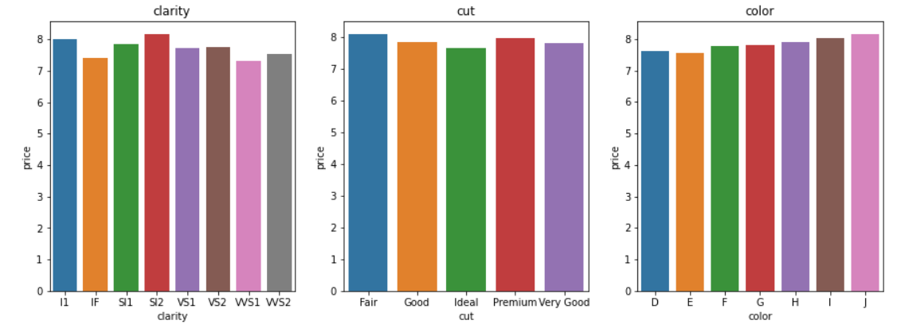

# Machine learning: Predecir precio Diamantes

## Descripción

-  En este trabajo se ha utilizado modelos de machine learning para predecir los precios de diamantes según sus caracteristicas.

## Manipulacion de los datos
### Outliers

En este trabajo se han realizado distintos modelos según la manipulacion de outliers:

* 1. Cargandome los outliers más extremos
* 2. Teniendo en cuenta todos los outliers(se ha analizado que en el test hay valores outliers)
### Estandarización
Variables predictoras: Se ha estandarizado las variables numericas continuas para mejorar el modelo.
Variables respuesta:
* 1. Estandarizando el precio (al predecir hay que desentadarizarlo)
* 2. Precio sin standarizar 
### Encoding
Para las variables categoricas, se ha realizado un ecnonding con orden dando mas peso a las variables cuyo precio es más alto. 

### Test y Submission
* Para cada uno de los modelos se ha subido una submission a Kaggle.

## Repositorio

- **Notebooks** Se encuantran los siguientes notebooks: Machine learning: para explorar los datos. Train: para encoding y estandarizacion. Modelo: para crear el modelo (Gradient/Random Forest/Decision tree) y Test (para predecir los precios)
- *Modelo 1*: Eliminando outliers
- *Modelo 2*: Cogiendo todos los outliers
- *Modelo sin estandarizar precios*: Sin estandarizar el precio
- **data**: Se encuentran los pickles y las submissions
- **images**: las imagenes utilizadas para este readme. 
        
   ## Librerias
- [Pandas](https://pandas.pydata.org/)
- [Numpy](https://numpy.org/)
- [Seaborn](https://seaborn.pydata.org/)
- [Matplotlib](https://matplotlib.org/)
- [Scipy](https://scipy.org/)
- Warnings
- [Scikit-learn](https://docs.python.org/3/library/warnings.html)

